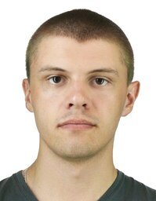

# Slava Shchipunov

## Contacts:
* phone: +7 923 390 07 83
* email: shchipunovsd@gmail.com
* discord nickname: Slava (@Slava-Shchipunov)
## About me:
My goal is to become a senior front-end developer. My priorities: development of my hard and soft skills, implementation of interesting projects, responsible performance of work duties. Perseverance and responsibility are my strengths. I haven't experience in IT, but I am studying front-end development and want to work in this area in the future.
## My skils:
HTML, CSS, JS, GIT, VSCode.
## Examples of my JS code:
```
function toBinary(n) {
  let count = 0;
  for (let i = 0; n >= 1; i++) {
    let y = n % 2;
    count += y * Math.pow(10, i);
    n = Math.floor(n / 2);
  }
  console.log(count);
  return count;
}
```
## My first project:
[Free_landing_page](https://github.com/Slava-Shchipunov/free_landing_page.git)
## My education:
Bachelor of Electrical Engineering
## English level:
A2
